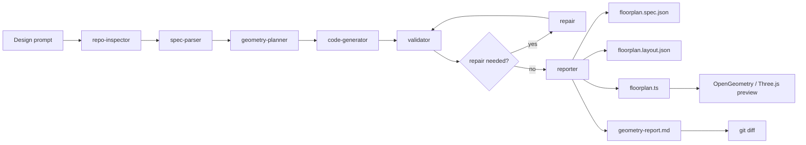

# GitCAD Agent

GitCAD Agent is a GitAgent-style workflow that turns constrained architectural prompts into validated OpenGeometry floorplan artifacts inside a repository.

It uses the repository itself as the agent workspace: the agent identity, rules, skills, tools, memory, generated CAD artifacts, validation report, preview, and git diff are all visible as files.

## Overview

GitCAD treats AI-assisted CAD generation like a software workflow. A design prompt is converted into a constrained floorplan spec, planned into geometry, rendered with OpenGeometry / Three.js, validated, and written back into the repository as reviewable artifacts.

The project is built with TypeScript / JavaScript, Vite, Three.js, and OpenGeometry. The deterministic workflow runs without API keys, while the optional LLM adapter can normalize live prompts before handing them to the same validation-first generation path.

The core product bet is that CAD agents should leave behind files a builder can inspect, validate, preview, and commit, instead of only returning a chat answer.

## Scope

The MVP is intentionally narrow so it can be demonstrated reliably:

- rectangular one-floor buildings
- rectangular rooms
- simple wall-hosted doors and windows
- deterministic layout generation
- validation report before preview
- generated files visible in git diff

## Why GitAgent

CAD generation should not stop at a chat answer. This workflow writes versioned repo artifacts, validates them, and leaves an auditable diff:

```text
prompt -> optional LLM adapter -> spec -> layout -> renderer -> validation report -> browser preview -> git diff
```

That makes the design process reviewable: prompts become specs, specs become geometry, geometry becomes code, and validation gives a pass/fail report before the preview is trusted.

## Architecture



## Agent Workflow

The root `agent.yaml` declares the workflow, model preferences, skills, tools, and generated output targets. Each role under `agents/` has its own `agent.yaml`, `SOUL.md`, and `RULES.md`.

Workflow roles:

- `repo-inspector`: reads repo structure, commands, and generated artifact paths
- `spec-parser`: normalizes the prompt into a constrained floorplan spec
- `geometry-planner`: converts the spec into room and opening geometry
- `code-generator`: writes OpenGeometry / Three.js preview code
- `validator`: checks geometry constraints and writes a report
- `repair`: reserved for validation-driven fixes
- `reporter`: summarizes artifacts, validation status, and demo commands

## Generated Artifacts

- `src/generated/floorplan.spec.json`
- `src/generated/floorplan.layout.json`
- `src/generated/floorplan.ts`
- `src/generated/geometry-report.md`

## Environment

The deterministic MVP runs without API keys. The live AI agent path should use `.env`:

```bash
cp .env.example .env
```

Preferred provider:

```env
OPENROUTER_API_KEY=
OPENROUTER_SITE_URL=http://localhost:5566
OPENROUTER_SITE_NAME=GitCAD Agent
GITCAD_MODEL_PROVIDER=google
GITCAD_MODEL=gemini-2.0-flash
```

Optional native provider fallbacks:

```env
ANTHROPIC_API_KEY=
OPENAI_API_KEY=
GEMINI_API_KEY=
```

`agent.yaml` uses OpenRouter first, then falls back to OpenRouter GPT latest, Anthropic Claude, and OpenAI. If the selected GitAgent runtime does not natively support the `openrouter:` provider string, use these values in the runtime adapter and keep the agent manifest as the source of truth.
The GitAgent docs list native provider strings such as `google:...`, `anthropic:...`, and `openai:...`; this repo keeps those in `agent.yaml`. OpenRouter is documented in `.env.example` and `config/default.yaml` as an adapter/provider option for runtimes that support it.

## Commands

```bash
npm run workflow
npm run workflow:llm
npm run generate
npm run build
npm run dev
```

`npm run workflow` is the multi-agent demo command. It executes the visible GitCAD roles in order, writes `workflow/repo-inspection.json`, regenerates the CAD artifacts, validates geometry, and writes `workflow/workflow-report.md`.

`npm run workflow:llm` runs the live adapter first when an API key is configured, writes `workflow/llm-adapter.json`, then hands the normalized constrained prompt to the same deterministic workflow. If no key is configured, it records a deterministic fallback instead of failing. Set `GITCAD_LLM_REQUIRED=1` to make missing or failed live calls fail the command.

Open the preview at:

```text
http://localhost:5566/gitcad-agent.html
```

## Verification

The repository has been verified locally with:

```bash
npm run workflow
npm run build
```

Expected workflow result:

```text
Workflow complete: PASS
```

## Demo Prompt

```text
Create a 12m x 8m apartment floorplan with a living room, bedroom, kitchen, bathroom, one main door, and two windows.
```

## Demo Video Outline

For the 3-5 minute challenge video:

1. Show the GitAgent structure: `agent.yaml`, `agents/`, `skills/`, `tools/`, `memory/`, and `workflows/`
2. Explain the workflow handoff: prompt -> spec -> layout -> renderer -> validator -> reporter
3. Run `npm run workflow`
4. Show `src/generated/geometry-report.md` and `workflow/workflow-report.md`
5. Run `npm run dev` and open `http://localhost:5566/gitcad-agent.html`
6. Show `git diff` to demonstrate auditable repository changes

## Thought Process

The product idea is to make AI-assisted CAD generation behave like software development. Instead of producing an unverifiable answer, the agent creates files, validates constraints, and leaves reviewable changes in git. The narrow floorplan scope keeps the demo shippable while still showing agent workflow design, validation, and a real visual output.
